Getting Started
=====================
SparcleQC is a Python package that automatically creates QM/MM-like input files for the quantum chemistry codes Psi4, Q-Chem, and NWChem. It specifically is designed for use with protein:ligand complexes. Main features include cutting the QM region out of the protein, capping the QM region with hydrogen link atoms, obtaining point charges for the MM region, and altering QM/MM boundary charges.

Detailed below is the main workflow of SparcleQC with input keywords in parenthesis. These keywords must be provided at runtime to SparcleQC either by a dictionary in Python or an input file on the command line as detailed in :doc:`installation`.

SparcleQC is fully automated. Users have the option of utilizing a CHARMM or Amber forcefield. As seen below, the Amber preparation can be done directly through SparcleQC, but CHARMM-GUI files must be uploaded manually to the working directly when using a CHARMM forcefield. 

1. System Preparation
----------------------

Provided a protein-ligand complex (pdb_file), SparcleQC will create a new directory with the name of the input file to place all created files. 

If specified (pre-capped), when utilizing Amber forcefields, SparcleQC can automatically cap the terminal residues with ACE and NME groups. This is not an option with CHARMM because users have an option to add capping groups when creating the input files in CHARMM-GUI. 

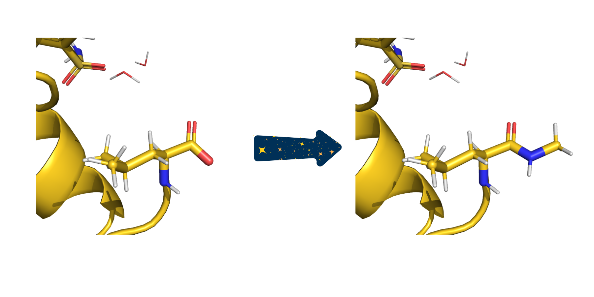
   
   In this example, the pre-capped keyword has been set to false so the termini are capped with ACE/NME. Here, the C terminus can be seen before and after capping with NME. 

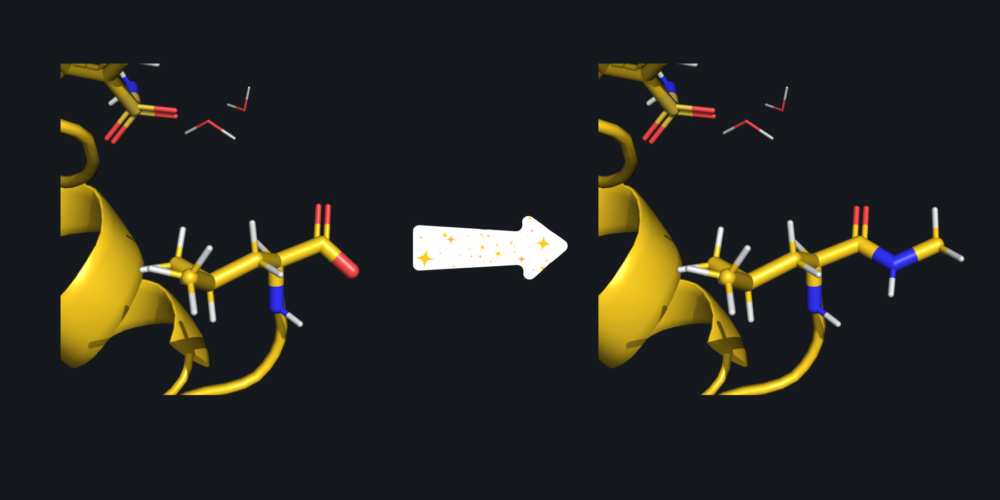
   
   In this example, the pre-capped keyword has been set to false so the termini are capped with ACE/NME. Here, the C terminus can be seen before and after capping with NME. 

2. Cutting out the QM Region
-----------------------------

To create the quantum mechanical subsystem, SparcleQC will carve out a section of the protein based on a user-specified distance (cutoff_radius). Any residues with at least one atom in within the radius will be included in the QM region. If no specification is made, the radius will expand from the whole ligand. However, if desired, the radius can extend from one specific atom in the ligand. This can be chosen by specifying the atom serial number/atomid (seed) and corresponding PDB (seed_file) to grow the QM region from. SparcleQC will sever C-C bonds, specifically the bond between the carbon of the peptide bond and the alpha carbon in the protein backbone.
   
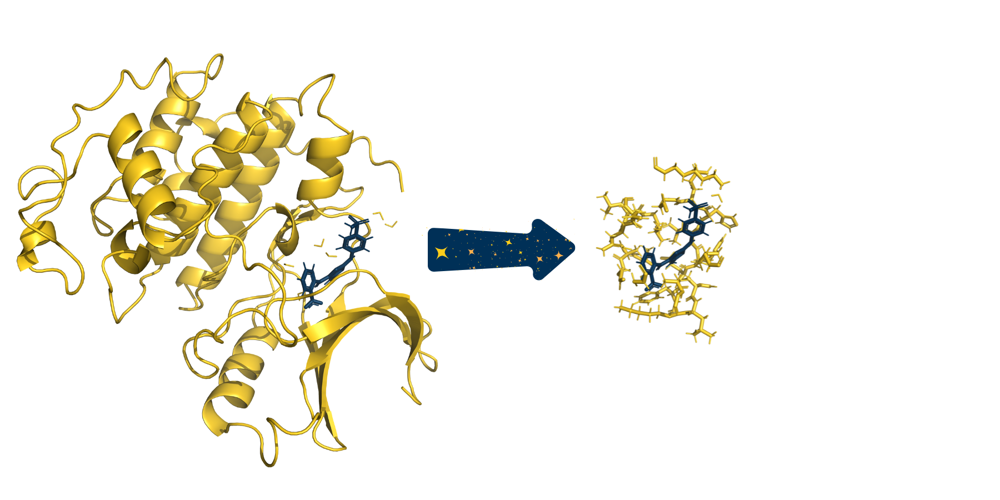
   
   The full system provided to SparcleQC can be seen on the left. After specifying a cutoff_radius of 3.5 Angstroms, the following cutout of the system was created. 

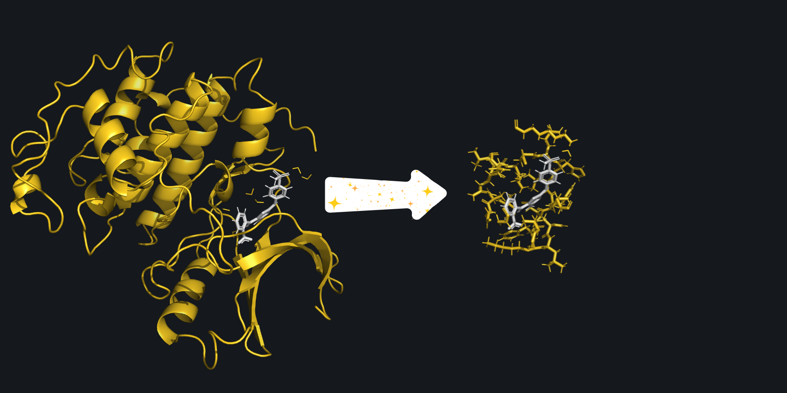
   
   The full system provided to SparcleQC can be seen on the left. After specifying a cutoff_radius of 3.5 Angstroms, the following cutout of the system was created. 

Because C-C bonds have now been severed, some carbons on the exterior of the created cutout do not have four bonds and therefore have unsatisfied valencies. SparcleQC automatically caps these bonds with hydrogen link atoms. 

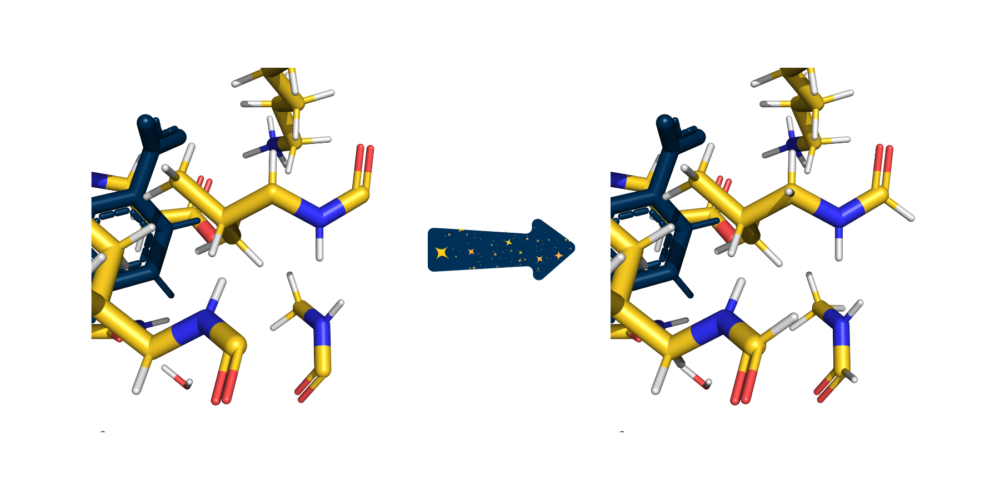
   
   In this zoomed in picture of the cutout from above, several carbonyls are picture with only three bonds because their fourth bonds were severed when creating the cutout. On the right, SparcleQC has capped these bonds with hydrogen link atoms. 

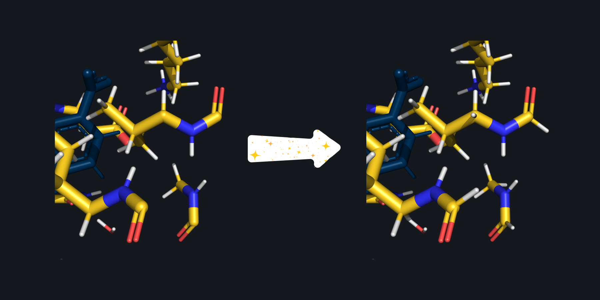
   
   In this zoomed in picture of the cutout from above, several carbonyls are picture with only three bonds because their fourth bonds were severed when creating the cutout. On the right, SparcleQC has capped these bonds with hydrogen link atoms. 

3. Obtaining Point Charges from a Forcefield
--------------------------------------------

The non-ligand atoms not included in the QM region will be turned into external charges in the QM calculation.

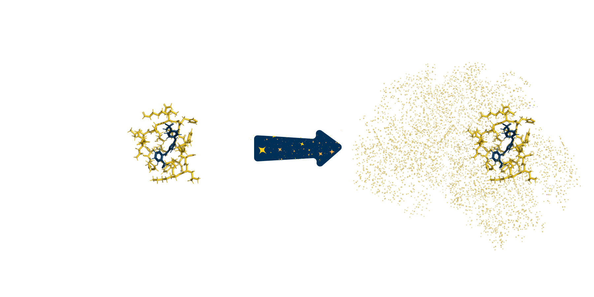
   
   The same cutout from above, now capped with hydrogens, is picture on the left. After adding back the rest of the system as point charges, the system on the right is obtained.

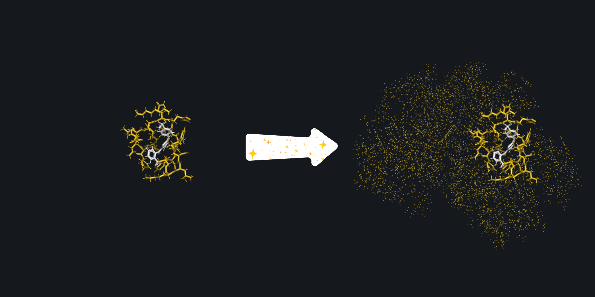
   
   The same cutout from above, now capped with hydrogens, is picture on the left. After adding back the rest of the system as point charges, the system on the right is obtained.
   
Based on a user chosen forcefield, SparcleQC will automatically obtain the correct point charges for the non-ligand atoms. As previously mentioned, SparcleQC is fully automated with Amber forcefields (amber_ff) and will obtain the charges based on the specified forcefield, but if a CHARMM forcefield is requested, point charges can be obtained using CHARMM-GUI and uploaded with the same name as (pdb_file) but with the .psf extension. Along with the psf, users must provide paths to the CHARMM topology and parameter files (charmm_rtf and charmm_prm) and the ligand in its own file as ligand.pdb.  

For Amber, a specific water model can be chosen (water_model) and/or the individual charges for the Oxygen, Hydrogen, and Extra Point Charge for a 4 point model can be chosen (o_charge, h_charge, ep_charge). 

4. Redistributing Boundary Charges
----------------------------------
   
Because the hydrogen link atoms are artifically added where there used to be a C-C bond, there are now point charges too close to the QM region. This will cause overpolarization of the QM region. SparcleQC supports 9 different options to redistribute these boundary charges (charge_scheme). Read more about the different charge schemes here :doc:`user_guide`. 

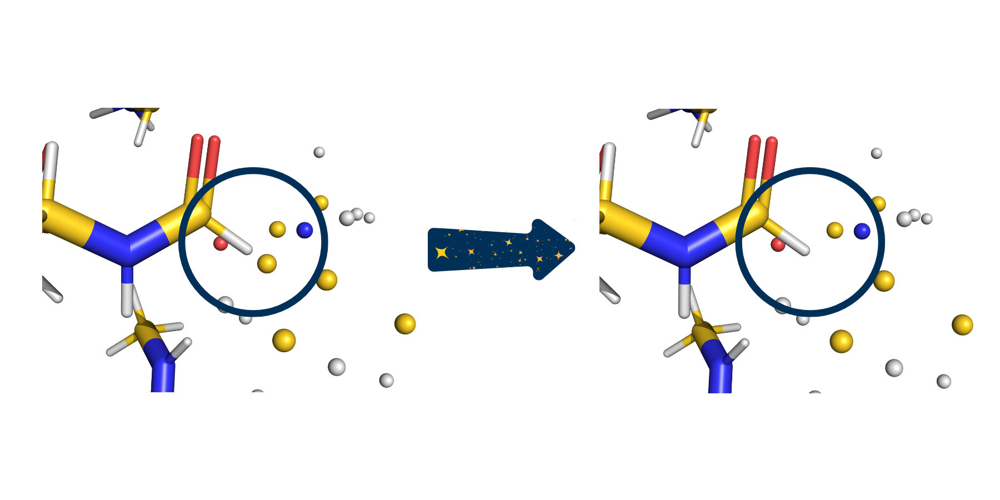
   
   The capped subsystem along with the point charges is pictured on the left. This zoomed in view reveals that the artifical hydrogen link atom is several tenths of an Angstrom from a point charge. On the right, SparcleQC has employed the Z1 charge scheme, zeroing the first MM atom next to the hydrogen, to avoid potential overpolarization. 

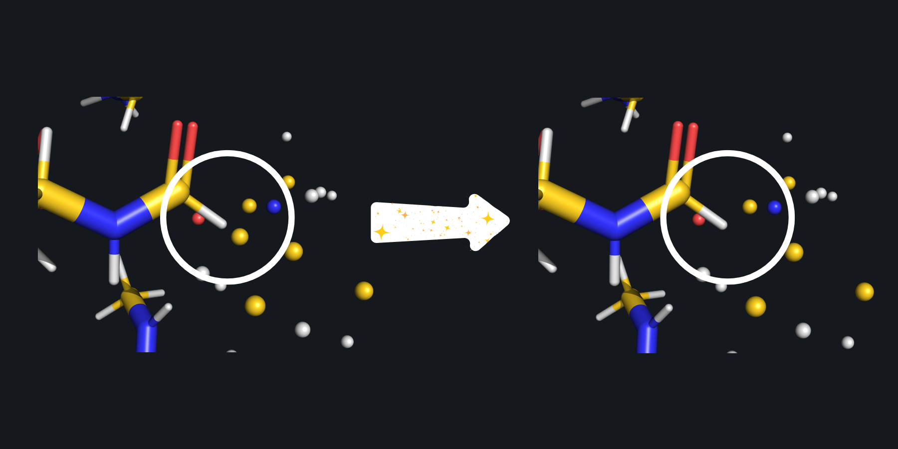
   
   The capped subsystem along with the point charges is pictured on the left. This zoomed in view reveals that the artifical hydrogen link atom is several tenths of an Angstrom from a point charge. On the right, SparcleQC has employed the Z1 charge scheme, zeroing the first MM atom next to the hydrogen, to avoid potential overpolarization. 

5. Writing a QM Input File
---------------------------

SparcleQC will write input files for 3 different softwares: NWChem, Psi4, Q-Chem (software) for a user chosen level of theory (method and basis_set). To avoid ambiguities in ligand isomers, the charge of the ligand must be specified (ligand_charge). Users may also specify if ghost atoms should be added for counterpoise correction (cp). 

Software specific keywords may also be controlled via the SparcleQC input file. More details can be found here: :doc:`user_guide`.

6. Extra Features
-----------------

Extra Amber forcefields (other_amber_ff) needed to obtain proper point charges for the protein can be added as well, for example for phosphorylated amino acids. 

If using FI-SAPT in Psi4, SparcleQC can automatically create the functional group partition files (fisapt_partition), fA.dat and fB.dat. More details about FI-SAPT can be found on `Psi4's website <https://psicode.org/psi4manual/master/fisapt.html>`_.

.. note::
   This partition has been successful in our group for the systems we have come across, but it is important to check these partition files for system specific nuances of functional groups. 

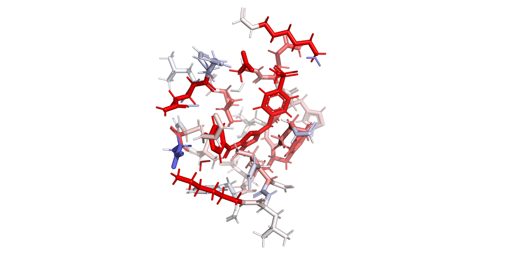
   
   Users can utilize FI-SAPT in Psi4 to obtain functional group partitions of the interaction energy. After running Psi4's post processing script for F-SAPT, a heat map of the interaction energy can be visualized on the protein structure, where red indicates a favorable interaction and blue indicates an unfavorable interaction.

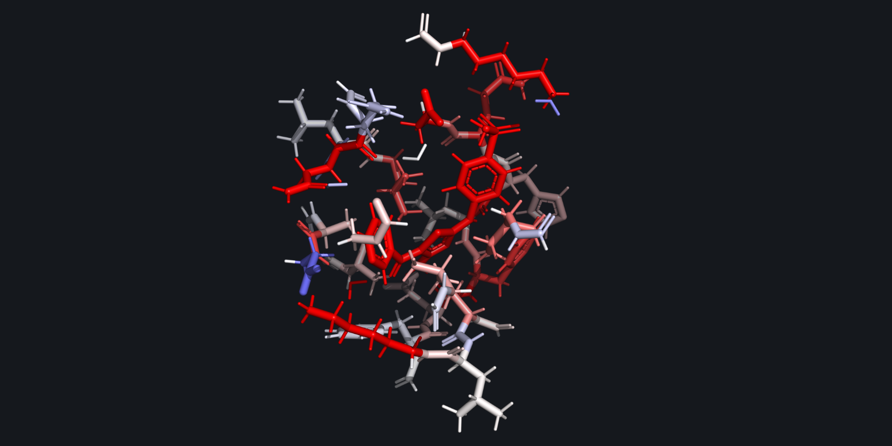
   
   Users can utilize FI-SAPT in Psi4 to obtain functional group partitions of the interaction energy. After running Psi4's post processing script for F-SAPT, a heat map of the interaction energy can be visualized on the protein structure, where red indicates a favorable interaction and blue indicates an unfavorable interaction.

SparcleQC can also create matched QM regions of two separate, but similar, proteins. Users can provide a finalized cx_autocap_fixed.pdb (template_path) from a previous SparcleQC run to serve as a template for a new SparcleQC run. The residues of the current protein will be mapped to the residues of the template protein by their neighborhood and the same amount of each residue will be included in the QM regions. Anything that cannot be matched via the residue neighborhood between the two proteins will be treated according to the normal distance-based criteria. This feature would be useful for any relative energy studies of proteins with congeneric ligands. Details can be found here :doc:`user_guide`.

.. note::
   This conversion script has been successful for system in our group. However, waters and uncommon atoms between the systems will purely be treated with the distance cutoff, so it is important to ensure that the CAPPED_qm.pdb files match in the way that the user intended after SparcleQC completes. 

7. Syntax of the Input Files
-----------------------------
These keywords that have been specified here in parenthesis should be assembled in an input file with any extension with the keyword followed by a colon and the value. Example: 
        
        amberff: ff19SB

Full example input files can be found here: :doc:`user_guide`

