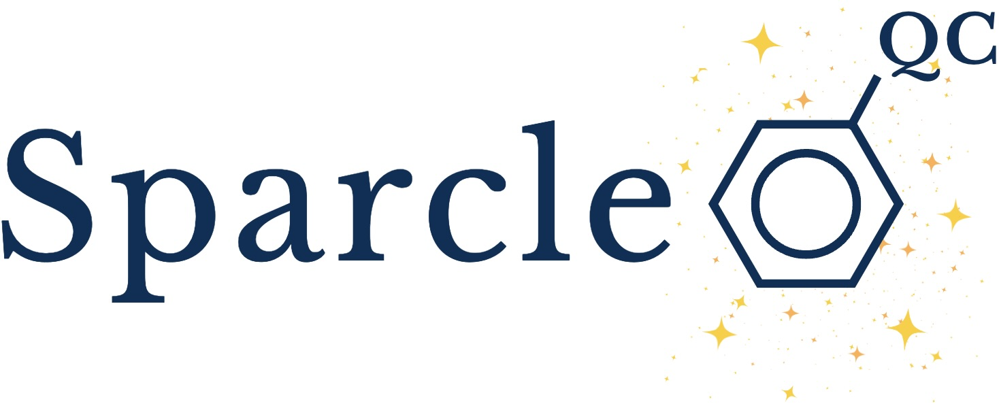
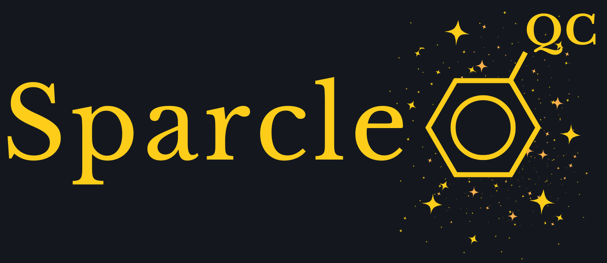
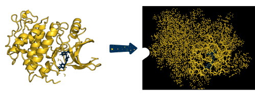
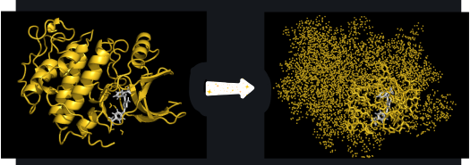

.. sparcle_qc documentation master file, created by
   sphinx-quickstart on Thu Mar 15 13:55:56 2018.
   You can adapt this file completely to your liking, but it should at least
   contain the root `toctree` directive.

.. title:: Index

Sparcle_QC is a Python package that automatically creates QM/MM-like input files for the quantum chemistry codes Psi4, Q-Chem, and NWChem. It specifically is designed for use with protein:ligand complexes. Main features include cutting the QM region out of the protein, capping the QM region with hydrogen link atoms, obtaining point charges for the MM region, and altering QM/MM boundary charges.

.. grid:: 1 1 2 2

    .. grid-item-card:: Getting Started
      :margin: 0 3 0 0
      
      Learn the basics of using sparcle_qc.

      .. button-link:: ./getting_started.html
         :color: primary
         :outline:
         :expand:

         To the Getting Started Guide

      

    .. grid-item-card::  User Guide
      :margin: 0 3 0 0
      
      See a list of all options and example input files.

      .. button-link:: ./user_guide.html
         :color: primary
         :outline:
         :expand:

         To the User Guide
      
      

    .. grid-item-card:: API Reference
      :margin: 0 3 0 0
      
      How to use the API of sparcle_qc.

      .. button-link:: ./api.html
         :color: primary
         :outline:
         :expand:

         To the API Reference.

      

    .. grid-item-card::  Developer Guide
      :margin: 0 3 0 0
      
      How to contribute to sparcle_qc.

      .. button-link:: ./developer_guide.html
         :color: primary
         :outline:
         :expand:

         To the Developer Guide

.. toctree::
   :maxdepth: 2
   :hidden:
   :titlesonly:

   getting_started
   user_guide
   api
   developer_guide

